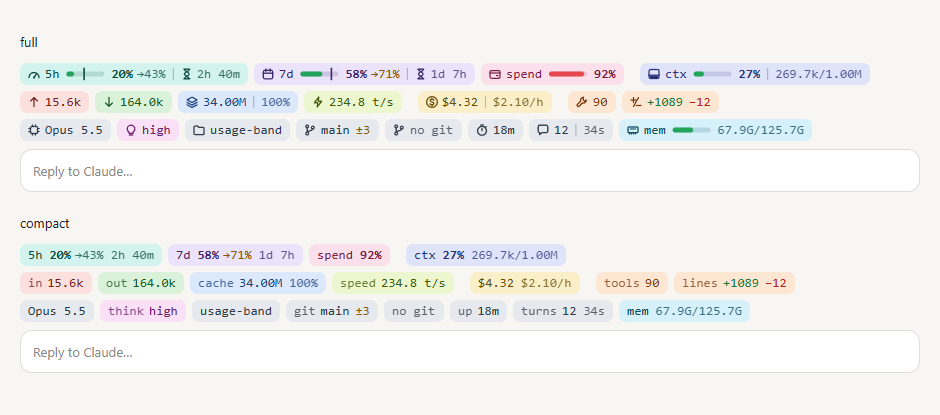
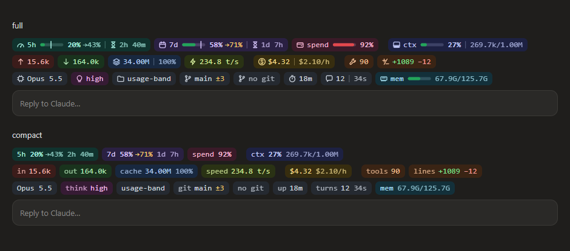

# claude-usage-band-cli

A usage band for [Claude Code](https://claude.com/claude-code), drawn right above the prompt: rate limits, context, tokens, speed, cost, tool calls, churn and session details at a glance. It's a Claude Code mod (a plugin of function hooks): in the terminal it draws three powerline lines with Nerd Font icons; in the desktop app's Code tab, rounded SVG pills that follow the light and dark theme.





---

## ⚡ Sponsored by WrongStack

<div align="center">

### _Built on the wrong stack. Shipped anyway._

**[WrongStack](https://wrongstack.com)** is a free, [open-source](https://github.com/WrongStack/WrongStack) AI coding agent with a Brain, a Memory, and a full toolbox. It reads your code, edits files, runs commands, and coordinates specialist agents — across six surfaces, from a plain terminal REPL to a cross-machine HQ dashboard. No subscription required, and you keep your hand on every permission.

[](https://wrongstack.com)
&nbsp;
[](https://github.com/WrongStack/WrongStack)
&nbsp;
[](https://github.com/WrongStack/WrongStack/stargazers)

```bash
curl -fsSL https://wrongstack.com/install.sh | sh   # macOS / Linux — self-contained binary
```

```powershell
irm https://wrongstack.com/install.ps1 | iex        # Windows (PowerShell) — no Node.js needed
```

</div>

| | What you get |
|---|---|
| 🌐 **[200+ LLM providers](https://wrongstack.com)** | Catalog pulled live from models.dev — Anthropic, OpenAI, Google, plus OAuth sign-in for Claude Pro/Max, ChatGPT and Copilot, and any OpenAI-compatible endpoint (Ollama, vLLM, LM Studio) |
| 🛠️ **[67 built-in tools](https://github.com/WrongStack/WrongStack)** | Edits, lint/typecheck/test, execution, git, web, browser/E2E and a SQLite codebase index — every call gated by per-tool permissions |
| 🧠 **[SAGE memory](https://github.com/WrongStack/WrongStack/blob/main/docs/sage/ARCHITECTURE.md)** | Project-wide long-term memory in SQLite/FTS5, anchored to files, symbols and commits — it gets better at *your* codebase over time |
| 🖥️ **[Six surfaces](https://wrongstack.com)** | Readline REPL · Ink/React TUI (`--tui`) · WebUI · SimpleUI · Desktop · cross-machine HQ (`--hq`) |
| 🤖 **[Fleet orchestration](https://github.com/WrongStack/WrongStack/blob/main/docs/director-architecture.md)** | A Director fans out specialist subagents over a project mailbox; `eternal` & `parallel` goal loops run until the contract verifies |
| 🔍 **[Chimera & Kanban](https://wrongstack.com)** | Auto-review agents that critique your diffs with severity-ranked findings, plus durable Kanban boards with atomic verification |
| 🔐 **[Secure by default](https://github.com/WrongStack/WrongStack/blob/main/SECURITY.md)** | Encrypted secrets at rest, project-root containment, opt-in YOLO mode — MIT licensed, TypeScript-strict |

> **📊 The perfect pairing:** This band tells you exactly where your Claude limits stand — and **WrongStack** keeps you moving when they close in. It reads plan windows for Claude, ChatGPT, Copilot, Z.AI and more right in its own statusline and quota page, and when one provider runs dry, **fallback chains** rotate you onto the next model automatically. Watch the band, dodge the wall.

<div align="center">

🔗 **[wrongstack.com](https://wrongstack.com)** &nbsp;·&nbsp; **[github.com/WrongStack/WrongStack](https://github.com/WrongStack/WrongStack)** &nbsp;·&nbsp; ⭐ **[Star it on GitHub](https://github.com/WrongStack/WrongStack/stargazers)**

</div>

---

## What it shows

| Line | Pills |
| --- | --- |
| 1 | **5h** and **7d** limits (bar, a marker for how much of the window has passed, `→` the projected usage at reset if the pace holds, reset countdown) · **spend** limit (gateways) · **ctx** context fill · session **cost** (and cost per hour) |
| 2 | **input** (uncached + cache writes) · **output** · **cache** reads (and hit rate) · output **speed** in t/s · **tool calls** · **lines** changed (+/−) |
| 3 | **model** · thinking **effort** · **folder** · **git** branch and changed files · session **duration** · **turns** (and the last turn's length) · machine **memory** |

- Bars are green, turning yellow from 70% and red from 90% (both adjustable).
- A toast appears when a limit crosses the yellow or red threshold.
- Every pill has a hover tooltip (desktop) with the breakdown: input split, context, request count, top tools, files touched, the full path…
- In the terminal the three lines stay fixed; if the window is too narrow, the same pills are rebalanced over three lines, and only on a very narrow terminal does it use more.
- Limits show up after the first model response of a session, as Claude Code reads them from the API.
- Cost is the session's cost at API list prices, not what a subscription pays.

## Requirements

- Claude Code with function hooks (validated and tested against 2.1.286 and 2.1.288).
- Node.js on `PATH` (or at `/usr/local/bin/node`, `/opt/homebrew/bin/node`), used by the token and memory scripts.
- `git` on `PATH` for the git pill.
- A [Nerd Font](https://www.nerdfonts.com/) in the terminal for the icons and the rounded powerline caps; without one, set `nerdFont` to `false` (text labels) or `terminalStyle` to `plain`.

## Install

Clone it anywhere, then load it as a plugin folder.

```sh
git clone https://github.com/ersinkoc/claude-usage-band-cli.git
```

For one session:

```sh
claude --plugin-dir /path/to/claude-usage-band-cli
```

For every session (the desktop app included), add it to the `env` block of `~/.claude/settings.json`:

```json
{
  "env": {
    "CLAUDE_CODE_PLUGIN_DIRS": "/path/to/claude-usage-band-cli",
    "CLAUDE_CODE_ENABLE_FUNCTION_HOOKS": "1"
  }
}
```

If `CLAUDE_CODE_PLUGIN_DIRS` already has folders, append this one with the platform's path-list separator (`:` on macOS/Linux, `;` on Windows). Start a new session after the change.

> The plugin is named `usage-band`. Don't load it together with another `usage-band` plugin: they'd claim the same command and state.

## Commands

| Command | Does |
| --- | --- |
| `/usage-band` | Refreshes everything and prints a one-line summary |
| `/usage-band hide` · `/usage-band show` | Hides or shows the band |
| `/usage-band settings` | Lists every setting with its current value |
| `/usage-band on <name…>` · `/usage-band off <name…>` | Turns pills on or off (`all` for every one) |
| `/usage-band set layout full\|compact` | Icons and bars, or text only |
| `/usage-band set style powerline\|plain` | Terminal style |
| `/usage-band set warn <1-100>` · `set hot <1-100>` | Yellow and red thresholds |
| `/usage-band set refresh <10-600>` | Refresh interval in seconds |

Names for `on`/`off`: `5h`, `7d`, `spend`, `pace`, `context`, `input`, `output`, `cache`, `hit`, `speed`, `cost`, `burn`, `tools`, `churn`, `model`, `effort`, `folder`, `git`, `memory`, `duration`, `turns`, `terminal`, `nerd`, `alerts` (aliases: `ctx`, `in`, `out`, `tps`, `lines`, `thinking`, `cwd`, `branch`, `mem`, `time`, `weekly`).

## Settings

All settings are also rows in `/config` (search "Usage band"), stored under `pluginConfigs["usage-band"].options` in `~/.claude/settings.json`. Changing one reloads the mod with the new value.

| Setting | Type | Default | What it does |
| --- | --- | --- | --- |
| `show5h` | boolean | `true` | Pill with the 5-hour window's usage, elapsed marker and reset countdown |
| `show7d` | boolean | `true` | Pill with the 7-day window's usage, elapsed marker and reset countdown |
| `showSpendLimit` | boolean | `true` | Pill for a gateway's spend limit, when the account reports one |
| `showPace` | boolean | `true` | On limit pills, where usage lands at reset if the current pace holds |
| `showContext` | boolean | `true` | Pill with the context window's fill |
| `showInput` | boolean | `true` | Uncached input + cache writes |
| `showOutput` | boolean | `true` | Tokens the model generated |
| `showCacheRead` | boolean | `true` | Input tokens served from the prompt cache |
| `showCacheHit` | boolean | `true` | On the cache pill, the share of input served from the cache |
| `showSpeed` | boolean | `true` | Tokens per second of the last response (hover for the average) |
| `showCost` | boolean | `true` | Session cost at API list prices |
| `showBurnRate` | boolean | `true` | On the cost pill, the session's cost per hour so far |
| `showTools` | boolean | `true` | Pill with the number of tool calls (hover for the top tools) |
| `showChurn` | boolean | `true` | Lines added and removed by Edit, MultiEdit and Write |
| `showModel` | boolean | `true` | Pill with the model that answered last |
| `showEffort` | boolean | `true` | The thinking effort of the last request (low … max) |
| `showFolder` | boolean | `true` | The working directory's name (hover for the full path) |
| `showGit` | boolean | `true` | The current branch and how many files changed |
| `showMemory` | boolean | `true` | This machine's memory in use |
| `showDuration` | boolean | `true` | Pill with how long the session has run |
| `showTurns` | boolean | `true` | Pill with the number of turns and the last turn's length |
| `showInTerminal` | boolean | `true` | Off to show the band only in the desktop app (when a status line already covers the terminal) |
| `terminalStyle` | `powerline` / `plain` | `powerline` | Colored powerline segments, or colored text |
| `nerdFont` | boolean | `true` | Icons and rounded powerline caps from a Nerd Font; off for text labels |
| `layout` | `full` / `compact` | `full` | Icons and bars, or text only |
| `warnAt` | number | `70` | Bars turn yellow at this percent |
| `hotAt` | number | `90` | Bars turn red at this percent |
| `alerts` | boolean | `true` | A toast when a limit crosses the yellow or red threshold |
| `refreshSeconds` | number | `30` | How often countdowns and totals refresh |

## Where the numbers come from

- **Limits, context, cost:** `$.session.usage()` and the `session.measure` event Claude Code raises after each turn.
- **Tokens, tool calls, lines changed, model:** [`scripts/tokens.mjs`](scripts/tokens.mjs) reads the session's transcript (`~/.claude/projects/*/<session-id>.jsonl`) and its subagents' transcripts. Each API response is written once per content block, so it counts each `(message.id, requestId)` once, taking the largest value of every usage field. It is re-run only when the transcript's size or modification time changes. If it can't run, the band falls back to the per-turn usage Claude Code reports and marks those numbers with `~`.
- **Effort and speed:** read from each main-loop model request as it streams; speed is output tokens over the time from the first streamed piece to the end of the response.
- **Git:** `git rev-parse`, `git branch --show-current` and `git status --porcelain` in the session's directory.
- **Memory:** [`scripts/sysinfo.mjs`](scripts/sysinfo.mjs) (`os.totalmem()` and `os.freemem()`).
- Countdowns and totals refresh every 30 seconds (adjustable).

## Layout

```
.claude-plugin/plugin.json   manifest and userConfig (the settings)
hooks/hooks.json             names the hooks module
hooks/register.tsx           hooks, state, settings, command, terminal drawing
hooks/pills.ts               formatting and the SVG pills (no engine calls)
scripts/tokens.mjs           transcript totals
scripts/sysinfo.mjs          machine memory
types/index.d.ts             the $.state contract
tests/band.test.tsx          claude plugin test suite
```

## Development

```sh
claude plugin validate .      # what the engine would load or refuse
claude plugin test .          # tests/band.test.tsx against the engine
```

Once Claude Code has loaded the folder it lays the API types into `.claude-plugin/types/` (git-ignored), and `npx -p typescript tsc -p .` type-checks the mod.

## License

[MIT](LICENSE)
